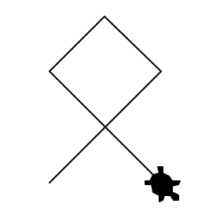
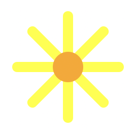

# Probe

:::danger[Wichtige Informationen]
- Falls Sie noch keine Bildschirmaufnahme gestartet haben, tun Sie dies bitte **jetzt**.
- Lösen Sie alle Aufgaben direkt **hier auf der Webseite**.
- Ihr Code wird automatisch gespeichert solange sie eingeloggt sind und ein grüner Punkt oben rechts neben ihrem Namen angezeigt wird.
- Hilfsmittel und Werkzeuge
  - Die gesamte **Unterrichtswebseite** darf verwendet werden.
  - Der **Taschenrechner** (physisch oder auf dem Computer) darf verwendet werden.
  - Die Verwendung **anderer Programme und Webseiten** (inkl. Google, ChatGPT, etc.) ist **verboten**!
:::

::::aufgabe[Aufgabe 1 \[2 Punkte\]]
<TaskState states={['unset', 'checked']} id="213ff557-2201-4298-8827-b676dedfff1a"/>

Zeichnen Sie mit der Turtle eine solche "Schleife". Das **Quadrat** oben hat eine **Seitenlänge von 50 Pixel**. Die beiden **Striche unten** sind auch **je 50 Pixel lang**. Die **Turtle** soll am Schluss **sichtbar sein** und **so aussehen, wie auf dem Bild**.



```py live_py title=aufgabe_2.py id=e0029848-ba98-4bf3-821f-95b594e3b5d3

```
::::


::::aufgabe[Aufgabe 2 \[3 Punkte\]]
<TaskState states={['unset', 'checked']} id="cc70557b-119b-4755-9e53-7a5be6d1f643"/>

Zeichnen Sie mit der Turtle diese "Sonnenblume". Die **"Blätter" (gelbe Striche)** haben eine **Strichbreite von 10 Pixel** und eine **Länge von 50 Pixel** (ab der Mitte gemessen, ein Teil davon ist vom orangen Punkt in der Mitte verdeckt). Der **orange Punkt** in der Mitte hat einen **Durchmesser von 30 Pixel** und soll **nicht von den Strichen verdeckt** sein. Die **Turtle** soll am Schluss **nicht mehr zu sehen** sein.



```py live_py title=aufgabe_2.py id=9af5f359-1812-4440-a637-8ed5c2adc995

```
::::

::::aufgabe[Aufgabe 3 \[4 Punkte\]]
<TaskState states={['unset', 'checked']} id="b0f5388b-3b5b-4e2f-ae09-d9cb1fea0e69"/>
Zeichnen Sie mit der Turtle dieses **rote** "Stoppschild" (ohne Text) auf einem **schwarzen Hintergrund** mit einem **weissen Rahmen**. Der **Rahmen** hat eine **Breite von 15 Pixel**. Die **Seitenlänge** der acht Linien des Randes beträgt je **100 Pixel**. Der **schwarze Hintergrund** muss das **ganze Turtle-Feld füllen**.

Die **Turtle** soll am Schluss **nicht mehr zu sehen** sein.


```py live_py title=aufgabe_3.py id=0c59ee69-f2c5-4e8b-a95b-ab4ea1b1fefc

```
::::

---